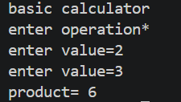
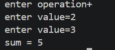
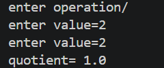
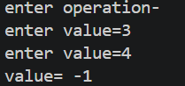
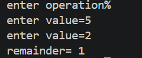
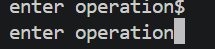

# Basic Calculator
This is a basic calculator , it works in terminal with basic calculations like addition, subtraction , multiplication , division , mod . It is written in python language .
# preview
1. multiplication
      
      

2. addition

 

 3. division

 

 4. subtraction

 

 5. mod

 

 6. any other funtion instead of basic function

 